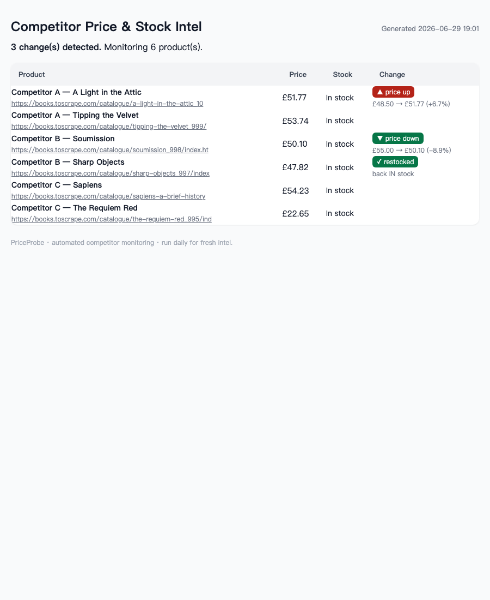

<div align="center">

# 📡 PriceProbe

**Track any competitor's prices & stock — free, self-hosted, zero dependencies.**

Point it at competitor product URLs → get a clean report of every price drop, hike, and stockout.
No subscription. No API keys. No account. Pure Python standard library.

[](LICENSE)


</div>

---

## See it in action



*Real output — competitor prices tracked, every change highlighted: ▲ price up, ▼ price down, ✓ restock.*

---

## Why

Most competitor-price tools charge **$40–100/month** to watch a handful of URLs. If you just want to
track a few competitors, that's overkill. PriceProbe is a tiny script you own and run yourself.

## What it does

- Fetches a list of competitor product pages (polite headers, gzip, retries, TLS-fallback)
- Extracts **price**, **title**, and **stock status** with robust regexes
- Diffs against the last run → flags **▲ price up / ▼ price down / ✕ out-of-stock / ✓ restock**
- Renders a clean, shareable **HTML report**
- **Pings you the moment something moves** — `notify.py` posts changes straight to Slack or Discord (any JSON webhook), so you never have to open the report
- **Runs itself, free** — a ready GitHub Actions workflow watches on a daily schedule with zero servers

## Quick start

```bash
git clone https://github.com/YOURNAME/priceprobe
cd priceprobe
# edit targets.example.json → your competitor URLs, save as targets.json
python3 monitor.py
open report.html
```

No `pip install`. No config files. Runs anywhere Python 3.8+ runs.

## Example

```json
[
  {"name": "Rival — Blue Hoodie", "url": "https://their-store.com/products/blue-hoodie"},
  {"name": "Rival — Red Cap",     "url": "https://their-store.com/products/red-cap"}
]
```

→ produces a report highlighting exactly what changed since yesterday.

## Automate it + get alerted (free, no server)

Fork this repo, drop your competitors into `targets.json`, and the included
[GitHub Actions workflow](.github/workflows/monitor.yml) runs the whole thing **daily on GitHub's
runners — free**. It:

1. checks every competitor URL,
2. commits the snapshot back (so day-to-day diffs actually work), and
3. runs `notify.py` to **ping your Slack/Discord** on any change.

Add one repo secret (`PRICEPROBE_WEBHOOK` = your Slack or Discord webhook) and you have a
hands-off competitor-price watchdog. No cron box, no server, no subscription.

```bash
python3 monitor.py && python3 notify.py   # run the pair locally, or let Actions do it
```

---

## 🚀 Want it done *for* you?

The free version above is everything a developer needs. But if you'd rather not fork, configure, and
babysit a workflow — **I'll run it for you.** Send your competitor URLs + where to ping you
(Slack, Discord, or email) and I watch them daily and alert you the moment a price or stock status
moves. No setup on your end.

**→ [Managed monitoring + alerts — see plans](https://willyverse188.gumroad.com/l/kphhe)**

You're paying for "never think about it again," not a rental you have to operate.

---

## License

MIT — do whatever you want. If it saves you money, a ⭐ is appreciated.

## Contributing

Site hides its price behind JavaScript? Open an issue with the URL and I'll add a matcher.
PRs for new extractors welcome.
